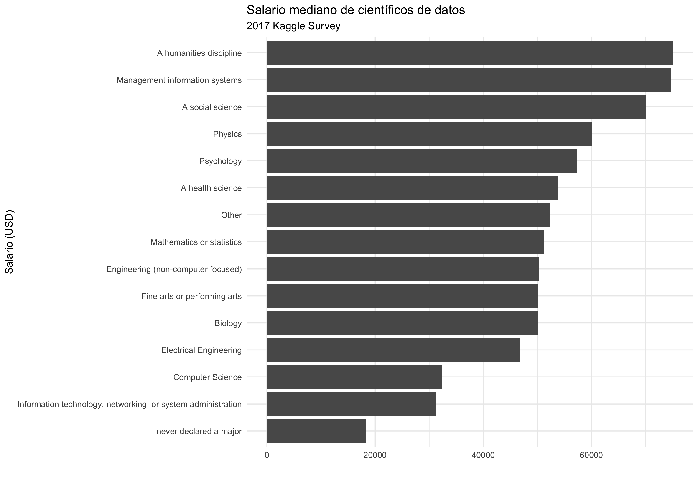

```{r setup, include=FALSE}
knitr::opts_chunk$set(echo = TRUE)
```

En 2017, la plataforma Kaggle realizó una encuesta en toda la industria para establecer una visión integral del estado de la ciencia de datos y el aprendizaje automático. La encuesta recibió más de 16.000 respuestas y arrojó luz acerca de quién está trabajando con datos, qué está sucediendo en la vanguardia del aprendizaje automático en todos los sectores industriales y cómo los nuevos científicos de datos pueden entrar mejor en este campo.

“La mayoría de nuestros encuestados se encontraron principalmente a través de los canales de Kaggle, como su lista de correo electrónico, foros de discusión y canales de redes sociales. La encuesta estuvo disponible del 7 al 25 de agosto. El tiempo medio de respuesta de quienes participaron en la encuesta fue de 16,4 minutos. Permitimos que los encuestados completaran la encuesta en cualquier momento durante ese período. Recibimos datos de salarios preguntando primero a los encuestados por su tipo de divisa y luego pidiéndoles que escribieran su compensación total”.

Los datos proporcionados aquí son un subconjunto de los resultados de la encuesta de Kaggle, conservando únicamente las observaciones con respuestas completas para las variables seleccionadas.
Más información aquí:
[https://www.kaggle.com/datasets/kaggle/kaggle-survey-2017](https://www.kaggle.com/datasets/kaggle/kaggle-survey-2017)


Aquí tenéis un diccionario de las variables presentes en los datos

|variable              |class     |description |
|:---------------------|:---------|:-----------|
|Country               |character | Home country of employee |
|Gender                |character | Selected gender, one of "A different identity", "Female", "Male", "Non-binary, genderqueer, or gender non-conforming"|
|Age                   |double    | Age at time of survey|
|EmploymentStatus      |character | One of "Employed full-time", "Employed part-time", or "Independent contractor, freelancer, or self-employed |
|EmployerIndustry      |character | Industry of current employer|
|FormalEducation       |character | Highest level of education|
|Major                 |character | College major|
|CompensationAmount    |double    | Total compensation|
|CompensationCurrency  |character | 3-letter currency code for day-to-day currency|
|CurrentJobTitle       |character | Job title|
|TitleFit              |character | Assessment of how well title fits actual duties. One of "Fine", "Perfectly", "Poorly"|
|LanguageRecommendation|character | Recommended programming language|
|WorkDataVisualizations|character | Proportion of job dedicated to creating data visualizations, broken into pre-determined categories|
|JobSatisfaction       |character |  Rating of job satisfcation one scale of 1-10, where 1 is not satisfied and 10 is highly satisfied|

## Ejercicio 1

Carga en R los ficheros `kaggle_survey_subset.csv` y `kaggle_conversionRates.csv`.
¿Qué contiene el dataset `kaggle_conversionRates.csv`?

### Solución

## Ejercicio 2

Para comparar salarios en distinta moneda, nos guataría agregar a los datos de 
`kaggle_survey_subset.csv` una columna llamada `exchangeRate` con la tasa de 
conversión a la divisa correspondiente. Esta columna se encuentra en el 
dataset `kaggle_conversionRates.csv`.

Escriba código que haga esto. Guarda el nuevo conjunto de datos usando el nombre
`datascience`.

### Solución


## Ejercicio 3

Ahora crea una nueva variable llamada `compensationUSD` que convierta el
`CompensationAmount` original a USD. Esto se logra multiplicando 
`CompensationAmount` por el `exchangeRate`. 
Guarda el nuevo conjunto de datos usando el nombre
`datascience`.

### Solución

## Ejercicio 4

Crea un nuevo conjunto de datos llamado `compensation_summary` que contenga la
remuneración mediana en USD por cada `Major`.
Además, ordena los resultados en orden descendente de mediana de salario.
Comenta lo que observas.

### Solución

## Ejercicio 5

Recrea el siguiente gráfico. 

**Pista**: para ordenar los major según salario mediano, deberás usar
`fct_reorder`. Busca en internet su uso.

**Pista**: para crear un gráfico de barras **bivariante**, especifica
el eje x e y en aes y añande `geom_bar(stat="identity")`. Recuerda que puedes
invertir las coordenadas con `coord_flip()`.

### Solución

```{r echo = F, fig.align="center", fig.width=6, fig.height=4}

```

## Ejercicio 6

Ordena los datos presentes en la base de datos de tidyverse `us_rent_income`.
Las variables en esta base de datos son `GEOID`, `NAME`, `estimate_income`, 
`estimate_rent`, `moe_income`, `moe_rent`.

### Solución


## Ejercicio 7

Extrae los aeropuertos de la base de datos `airports` para los cuales existe
algún vuelo cuyo destino sea ese aeropuesto dentro de la base de datos `flights`.

### Solución

## Ejercicio 8

Representa un mapa de los Estados Unidos donde cada aeropuerto de destino aparezca como un punto.
El tamaño del punto ha de ser proporcional al valor medio del tiempo de vuelo (`air_time`)
a ese aeropuerto (desde cualquier aeropuerto de NYC).
Repite el ejercicio excluyendo el aeropuerto de Alaska y el de Hawaii.

¿Qué observas?

**Pista:** Para representar el mapa de EEUU puedes usar la siguiente función, donde
`data` contiene al menos dos columnas llamadas lat (la latitud del aeropuerto) y
lon (su longitud). 

```{r, eval=F}
ggplot(data, aes(lon, lat)) +
    borders("state") +
    geom_point() + theme_classic() +
    coord_quickmap()
```

**Pista:** Las coordenadas de cada aeropuerto de destino están en la base de datos
`airports`.

### Solución

## Ejercicio 9

Elabora una visualización similar a la anterior donde muestres la distribución espacial del retraso medio de los vuelos del día 13 de Junio. Compara esta distribución la de otro día, por ejemplo el 13 de Mayo. ¿Qué observas? Intenta determinar el origen del patrón (buscando en Google).

### Solución


## Ejercicio 10

Estudia la relación entre las condiciones climáticas en el origen y el retraso medio de los vuelos. ¿Qué condiciones climáticas parecen afectar más a los retrasos? Justifica tu respuesta con una tabla o una visualización.

### Solución


## Ejercicio 11

Estudia la relación entre la edad de los aviones y el retraso medio de los vuelos. Para ello, tendrás que juntar la base de datos `planes` con `flights`, y crear una nueva variable llamada `age`, que corresponda a la edad del avión que realizó el vuelo, en años. Asigna edad 25 a los aviones con más de 25 años antes de estudiar la relación entre el retraso medio y la variable `age`. ¿Qué observas? Justifica tu respuesta con una visualización y tratar de dar una posible explicación al fenómeno observado.

### Solución

