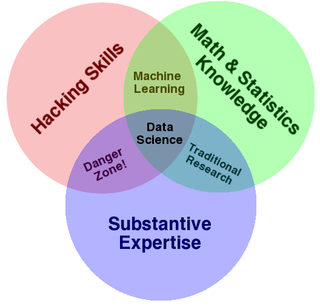

```{r packages_setup, echo=FALSE, message=FALSE, warning=FALSE}
knitr::opts_chunk$set(echo = T, warning = F, message = F)
knitr::opts_chunk$set(fig.width=8, fig.height=6) 
```

class: center, middle, inverse, title-slide

<div class="title-logo"></div>

# Análisis y Explotación de la Información

## Tema 0 - Introducción

<br>
<br>
<br>
<br>
<br>
.pull-left[
### Roi Naveiro
]


---

## ¿Qué es la Ciencia de Datos?

*"Data science is a concept to unify statistics, data analysis, machine learning and their related methods in order to **understand and analyze** actual phenomena with **data**. It employs techniques and theories drawn from many fields within the context of <font class="vocab">mathematics, statistics, information science, and computer science</font>."*

.pull-right[
[-Wikipedia](https://en.wikipedia.org/wiki/Data_science)
]

---

## ¿Qué es la Ciencia de Datos?




---

## ¿Qué son los Datos?

*"A collection of discrete units of information that in their most basic forms convey quantity, quality, fact, statistics, or other basic units of meaning."*

.pull-right[
[-Wikipedia](https://en.wikipedia.org/wiki/Data)
]

--

<br>
<font class="vocab">¡Definición bastante vaga!</font>

---

## Tipos de Datos

* Cualquier unidad de información es un dato

* Una distinción importante

  * Datos estructurados
  * Datos no estructurados
  
---

## Datos Estructurados

Datos tabulares


---

## Datos No Estructurados

Todo lo demás

* Imágenes

* Audio

* Vídeo

* Texto

---


## Tipos de Análisis de Datos

* Descriptivo

* Exploratorio

* Inferencial

* Predictivo

* Causal

---

## Análisis Descriptivo

**Objetivo**: resumir la información presente en un conjunto de datos

  * Primer tipo de análisis de datos a realizar
  * En general, las descripciones no se pueden generalizar sin la ayuda de modelos estadísticos
  
---

## Análisis Descriptivo

La base de datos `mtcars` de R contiene información extraída de la *1974 Motor Trend US magazine* acerca de 10 aspectos de diseño de rendimiento de 32 vehículos. La variable `am` se refiere a la transmisión (0 = automática, 1 = manual)

```{r,fig.align='center',out.extra='angle=90', echo=FALSE}

library(dplyr)
library(explore)
mtcars %>% explore(am)

```

---

## Análisis Exploratorio

**Objetivo**: descubrir relaciones entre características de los datos 

  * Motiva preguntas de investigación

---

## Análisis Exploratorio

La variable `wt` se refiere al peso del vehículo y `mpg` a las millas por galón

```{r,fig.align='center',out.extra='angle=90', echo=FALSE}

library(dplyr)
library(explore)
mtcars %>% explore(wt, mpg)

```

---

## Análisis Inferencial

**Objetivo**: usar una muestra pequeña de datos acerca de una población para extraer alguna información acerca de la misma.

  * Aquí entra en juego la **estadística**
  
---

## Análisis Inferencial

```{r, echo=FALSE, out.width = '100%',  fig.align='center'}
knitr::include_graphics("img/pollution.png")
```


---
## Análisis Predictivo

**Objetivo**: utilizar datos sobre un conjunto de objetos para predecir el valor de una variable en un objeto nunca antes visto

  * X predice Y no implica que X sea causa de Y

---
## Análisis Predictivo

```{r pressure, echo=FALSE, out.width = '80%',  fig.align='center'}
knitr::include_graphics("img/soy.svg")
```

[Fuente](https://www.r-bloggers.com/2020/11/time-series-demand-forecasting/)

---
## Análisis Causal

**Objetivo**: encontrar qué le sucede a una variable cuando se modifica el valor de otra

  * Las relaciones causales usualmente identifican efectos medios, no efectos individuales

---
## Análisis Causal


$$\\[1in]$$

```{r, echo=FALSE, out.width = '100%',  fig.align='center'}

```


---
## Este curso

Adentrarnos en la ciencia de datos a través de R

* Datos Tabulares (observaciones x variables)

* Análisis Descriptivo, Exploratorio, Inferencial


$$\\[0.3cm]$$

```{r, echo=FALSE, out.width = '100%',  fig.align='center'}
knitr::include_graphics("img/data-science-explore.png")
```

Aprenderemos las herramientas fundamentales de R para las distintas fases de este esquema.
---
## Las fases de un proyecto de análisis de la información

1. **Importación**: cargar datos en R procedentes de: base de datos, fichero, aplicación web (API), etc.

2. **Organización**: almacenar datos de manera consistente con análisis.

3. **Transformación**: filtrado, creación de variables derivadas, etc.

4. **Visualización**:  generación de preguntas, descubrimiento de tendencias.

5. **Análisis Exploratorio**: Visualización + tranformación aplicados de forma sistemática.

6. **Modelización**: confirmar hipótesis, responder preguntas.

7. **Comunicación**: comunicar resultados

---
## Las fases de un proyecto de análisis de la información


- 1,2,3 $\rightarrow$ Data Wrangling
- 2,3 $\rightarrow$ Data exploration
- 4 $\rightarrow$ Modelización
- 5 $\rightarrow$ Comunicación


Todo esto usando el **lenguaje de programación R**.

---

## Programa

- Tema 1 - Programación en R

- Tema 2 - Análisis Exploratorio de los Datos

- Tema 3 - Data Wrangling

- Tema 4 - Modelización

- Tema 5 - Comunicación de resultados 


---

## R y RStudio


### ¿Qué es R/RStudio?

- R es un lenguaje de programación especializacido en estadística
- RStudio es una interfaz para programar en R

```{r, echo=FALSE, out.width = '80%',  fig.align='center'}
knitr::include_graphics("img/r-rstudio.png")
```


[Instalación de R y RStudio](https://rstudio-education.github.io/hopr/starting.html)


---

## Presentación

* Análisis y Explotación de la Información. Grado en Ingeniería Informática

* Profesor: Roi Naveiro

* Email: roi.naveiro@cunef.edu

* Web del curso: [https://cunef-aeinf-fall2023.github.io/](https://cunef-aeinf-fall2023.github.io/)

---

## Horario

* *Horario clases*: 

  - Jueves 8.30 - 9.30
  - Jueves 10.30 - 11.30
  - Viernes 11.00 - 12.00

* *Asistencia:* Obligatoria, al menos 80%
---

## Evaluación

* **Convocatoria Ordinaria**

  - Evaluación contínua: Examen  1: 20%
  - Evaluación contínua: Examen  2: 20%
  - Examen Ordinario Final: 60% (toda la materia)
  
* **Convocatoria Extraordinaria**: Examen Extraordinario Final (60%) + Evaluación contínua. La nota de la contínua para la convocatoria extraordinaria será la mejor entre:

  - Evaluación contínua
  - Media ponderada de la evaluación contínua y el examen ordinario final


---

## Recursos Interesantes

* [Análisis de datos acerca de la evolución de las tendencias musicales](https://towardsdatascience.com/billboard-hot-100-analytics-using-data-to-understand-the-shift-in-popular-music-in-the-last-60-ac3919d39b49)

* [A year as told by FitBit](https://livefreeordichotomize.com/2017/12/27/a-year-as-told-by-fitbit/)

* [Charla TED](https://www.youtube.com/watch?v=hVimVzgtD6w)

* [RMarkDown](https://www.rstudio.com/wp-content/uploads/2015/02/rmarkdown-cheatsheet.pdf)
---

## Bibliografía

* [Hands-On Programming with R](https://rstudio-education.github.io/hopr/), Grolemund (2014)

* [R for Data Science](https://r4ds.had.co.nz/), Wickham and Grolemund (2016)

* [Data Visualization, A practical introduction](https://socviz.co/), Healy (2018)

* [Data Science Specialization](https://github.com/DataScienceSpecialization/courses), Johns Hopkins University, Coursera

