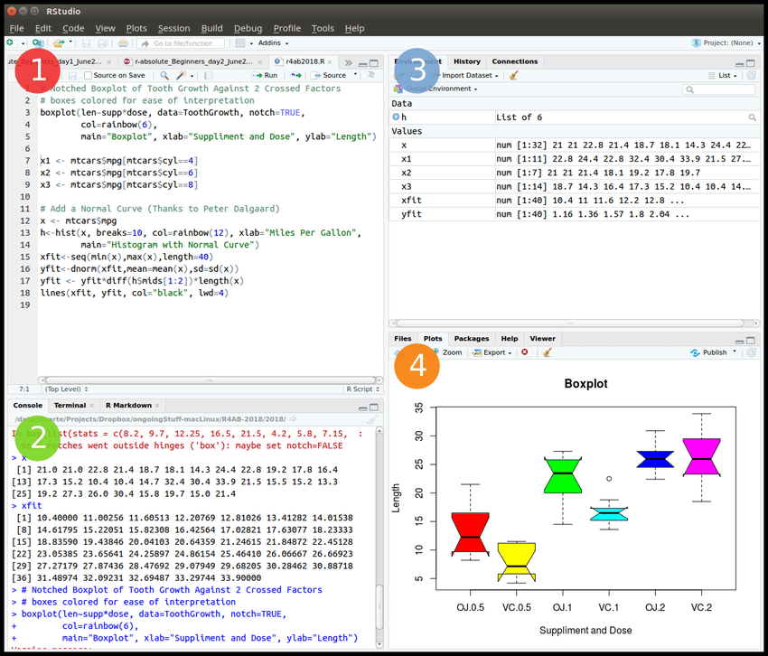
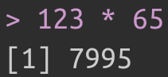
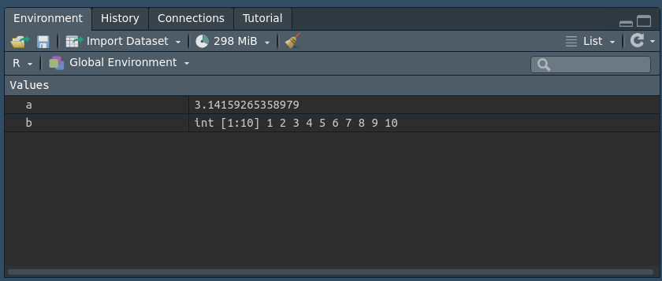

```{r packages_setup, echo=FALSE, message=FALSE, warning=FALSE}
knitr::opts_chunk$set(echo = T, warning = F, message = F)
knitr::opts_chunk$set(fig.width=8, fig.height=6) 
```

class: center, middle, inverse, title-slide

<div class="title-logo"></div>

# Análisis y Explotación de la Información

## Tema 1 - Programación en R

<br>
<br>
<br>
.pull-left[
### Roi Naveiro
]


---


## R y RStudio


### ¿Qué es R/RStudio?

- R es un lenguaje de programación especializacido en estadística
- RStudio es una interfaz para programar en R

```{r, echo=FALSE, out.width = '80%',  fig.align='center'}
knitr::include_graphics("img/r-rstudio.png")
```


[Instalación de R y RStudio](https://rstudio-education.github.io/hopr/starting.html)

---

## Interfaz de usuario de R

- RStudio: forma de comunicarse con máquina
- R: lenguaje de comunicación

```{r, echo=FALSE, out.width = '70%',  fig.align='center'}

```
---

class: center, middle, inverse

# Introducción

---
## Ejecutar comandos

```{r, echo=TRUE}
123 * 65
```

En consola aparece como

```{r, echo=FALSE, out.width = '20%',  fig.align='center'}

```


```{r, echo=FALSE}
options(width = 60)
```

```{r, echo=TRUE}
1000:1020
```

Uso como calculadora

```{r, echo=TRUE}
(7 + 7) / 7 * 2 
```

---


## Comentarios

* Comentarios con `#`

```{r, echo=TRUE}
# Esto es un comentario
# Sumo los números del 1 al 100
sum(1:100)
```

* Salida de código con `##`

* Comprueba que la siguiente expresión es cierta para $K=100$ y $K=1000$

  $$
  \sum_{i=1}^{K} i = \frac{K \cdot (K + 1)}{2}
  $$
---
## Objetos

* Si queremos un valor (o conjunto de valores) de forma recurrente hay que **guardarlos en memoria**, dándole un nombre.

```{r, echo=TRUE}
# Esto crea un objeto de R con valor pi
a <- pi

# Sumo 3 al valor guardado
a + 3
```

* Podemos guardar múltiples valores

```{r, echo=TRUE}
b <-1:10
b
```

---
## Objetos

Los objetos guardados aparecen en la ventana de *Environment*

```{r, echo=FALSE, out.width = '100%',  fig.align='center'}

```

El nombre de un objeto no puede empezar con un número, ni tampoco incluír ciertos caracteres especiales como `^`, `$`, `@`, etc.

---
## Objetos

R sobre-escribe

```{r, echo=TRUE}
c <- 5
c

c <- 20
c
```

La función `ls()` muestra nombres usados

```{r, echo=TRUE}
ls()
```

---
## Operaciones sobre objetos

* R realiza operaciones *element-wise*

* Vector - Número
```{r, echo=TRUE}
b <- 1:10
b + 7
```

* Vector - Vector (misma longitud)
```{r, echo=TRUE}
b * b
```

---
## Operaciones sobre objetos

* Vector - Vector (diferente longitud)

```{r, echo=TRUE}
# R repite el vector corto hasta alcanzar la longitud del largo
# Si la longitud del corto no es múltiplo de la del largo lanza un warning
d <- 1:2
e <- 1:4

d * e
```

¡Pruébalo!

---

## La función `c()`

Esta función nos ayuda a combinar objetos.
Por ejemplo, podemos crear un vector de enteros de la siguiente forma

```{r, echo=TRUE}
a <- c(1,2,3)
a
```

También podemos añadir elementos a un vector existente
```{r, echo=TRUE}
a <- c(a, 4,5)
a
```

No solo podemos crear vectores de números!

```{r, echo=TRUE}
a <- c('adiós', 'hola')
a
```
---

class: center, middle, inverse

# Funciones

---
## Funciones

R tiene muchas funciones predefinidas 
```{r, echo=TRUE}
# Calcula la media de los números del 1 al 10
mean(1:10)

# El argumento de una función puede ser el resultado de otra función
round(mean(1:10))
```

---
## Funciones

Algunas funciones tienen múltiples argumentos. Cada uno tiene un nombre

```{r, echo=TRUE}
# Muestrea un número del 1 al 10
sample(x = 1:10, size = 1)

# Nombre opcional
sample(1:10, 1)
```

---
## Funciones

La función `args()` muestra los argumentos de una función
```{r, echo=TRUE}
args(sample)
```

¡Algunas tienen valores por defecto! 
Pregunta, ¿qué valores tiene por defecto la función `round()`?

**Buena práctica**: escribir nombre de argumentos (salvo quizás el primero).

---
## Algunas Funciones 

| Función   | Significado                   | 
|:----------|:------------------------------| 
| `log`      | Logaritmo Nat.               | 
| `exp`      | Exponencial                  | 
| `min`      | Elem. mínimo                 | 
| `max`      | Elem. máximo                 | 
| `sum`      | Suma                         | 
| `mean`     | Media                        | 
| `median`   | Mediana                      | 
| `var`      | Variaza                      | 
| `sd`       | Dev. Est.                    | 
| `quantile` | Cuantiles 0, 25, 50, 75, 100 | 
| `cor`      | Correlación                  | 

---
## Definiendo funciones propias

* Permiten definir operaciones de uso recurrente (no implementadas en R).
```{r, echo=TRUE, eval=FALSE}
una_funcion <- function(){}
```

* Función que genera 10 números entre 1 y 100 y devuelva su suma

--

```{r, echo=TRUE}
gen2_1_100 <- function(){
  nums <- sample(1:100, size = 2, replace = TRUE)
  print(nums)
  return(sum(nums))
}
```

---
## Definiendo funciones propias

* La probamos

```{r, echo=TRUE}
a <- gen2_1_100()
a
```

---
## Definiendo funciones propias

* Argumentos

```{r, echo=TRUE}
# Pasamos el tamaño como argumento
# 2 es el valor por defecto
gen2_1_100 <- function(n=2){
  nums <- sample(1:100, size = n, replace = TRUE)
  print(nums)
  return(sum(nums))
}
```

* La probamos sin argumento

```{r, echo=TRUE}
gen2_1_100()
```

---
## Definiendo funciones propias

* La probamos con argumento
```{r, echo=TRUE}
gen2_1_100(10)
```

---
## Ejercicio 1

Escribe una función que devuelva $k$ números, donde cada número es
la suma de $n$ números escogidos al azar entre 1 y 100 (con reemplazamiento), divido entre n.

Pinta un histograma con los resultados de $k=10000$ para $n=1$, $n=2$, $n=10$ y $n=100$.
Pista: puedes usar la función `hist()`.

¿Qué observas?

---

class: center, middle, inverse

# Paquetes y ayudas

---
## Paquetes y ayudas

* **Importante**: el primer paso en la creación (de cualquier cosa) consiste en comprobar si alguien ya la ha creado...

* ...lo mismo para funciones en R.

* Muchas funciones de R han sido creadas y encapsuladas en **paquetes**.

* [Aquí](https://rstudio-education.github.io/hopr/packages2.html) podéis ver cómo instalar y actualizar paquetes en R.

---
## Paquetes y ayudas

* Ejemplo, instalar `tidyverse`

```{r, eval=FALSE}
install.packages("tidyverse")
```

* Para usar paquetes en R hay que cargarlos

```{r, eval=TRUE}
library("tidyverse")
```

---
## Paquetes y ayudas

* Existen infinidad de funciones en R y sus paquetes...

* ...memorizar todo es complicado (y absurdo).

* Las funciones cuentan con ayudas, que se invocan de la siguiente manera

```{r, eval=FALSE}
?sample
```

---
## Paquetes y ayudas

* La mejor fuente de ayuda es internet

* Por ejemplo, [Stack Overflow](https://stackoverflow.co/)

* Otro recurso interesante es [community.rstudio.com](https://community.rstudio.com)

---
## Ejercicio 2

Utiliza internet para conocer el funcionamiento de la función `replicate()` 
Resuelve el Ejercicio 1 sin usar un bucle (si es que lo habías usado).

---

class: center, middle, inverse

# Objetos de R

---
## Objetos de R

Un objeto de R es una estructura de datos que tiene algunos métodos y atributos asociados.

Estudiaremos los siguientes objetos:
1. Vectores atómicos
2. Matrices
3. Arrays
4. Fecha y hora
5. Factores
6. Listas
7. Data frames
---
## 1. Vectores atómicos

No son más que vectores de datos. Ya hemos visto cómo crearlos.

```{r}
a = c(1,2,3)

# Comprueba si es vector
is.vector(a)

# Devuelve la longitud del vector
length(a)
```

Cada vector sólo guarda un tipo de dato

---
## 1. Vectores atómicos
### Tipos de datos - Doubles

Los vectores tipo double almacenan números reales

```{r}
a = c(1.7,2,3.5)

# Devuelve el tipo de vector
typeof(a)
```

---
## 1. Vectores atómicos
### Tipos de datos - Enteros

Los vectores tipo entero almacenan números enteros

```{r}
a = c(1L,-2L,3L)

# Devuelve el tipo de vector
typeof(a)
```
---
## 1. Vectores atómicos
### Tipos de datos - Caracteres

Los vectores tipo caracter (string) almacenan texto

```{r}
a = c("Hola", "Adiós")

# Devuelve el tipo de vector
typeof(a)
```

OJO: ¿Qué está sucediendo?
```{r}
a = c(1,2,3,"Hola")
a
```

Este fenómeno se llama **coerción**. Es importante que leas sobre el mismo en
[https://rstudio-education.github.io/hopr/r-objects.html#coercion](https://rstudio-education.github.io/hopr/r-objects.html#coercion).

---
## 1. Vectores atómicos
### Tipos de datos - Lógicos
Los vectores tipo lógico almacenan `TRUE` o `FALSE` (datos Booleanos).

```{r}
a = c(5>4, 4>5)
typeof(a)
a
```

---
## Operaciones lógicas

<br>
<br>

| Operador  | Significado       | 
|:----------|:------------------| 
| `==`      | Igual a           | 
| `!=`      | Distinto de       | 
| `>`       | Mayor             | 
| `>=`      | Mayor o igual     | 
| `<`       | Menor             | 
| `<=`      | Menor o igual     | 
| `%in%`    | Está en conjunto  |

---
## Inciso: Atributos

Son piezas de información que se pueden adjuntar a los objetos de R.

```{r}
a = 1:10
attributes(a)
```

Algunos atributos importantes: nombres y dimensión

---
## Atributos - Nombres
```{r}
a = 1:3
# Asigno nombres al vector a
names(a) <- c("uno", "dos", "tres")
names(a)

#Compruebo que se ha guardado el atributo
attributes(a)
```

---
## Atributos - Dimensión
```{r}
a = 1:10
# Asigno dimensión, esto convierte a en matriz

dim(a) = c(2,5)

#Compruebo la dimensión
dim(a)
```

---
## 2. Matrices
Se utilizan para almacenar matrices bi-dimensionales

```{r}
m <- matrix(1:10, nrow=2)
m
m <- matrix(1:10, nrow=2, byrow=TRUE)
m
```

---
## 3. Arrays
Se utilizan para almacenar matrices n-dimensionales
```{r}
m <- array(1:12, dim = c(2,2,3))
m
```

---
## Inciso: Clases

Una clase es simplemente la huella de un objeto de R
Representa el conjunto de propiedades o métodos que son comunes a todos los objetos de un tipo.
La función ´class´ describe el tipo de clase correspondiente al objeto.

```{r}
m <- array(1:12, dim = c(2,2,3))
class(m)
```

---
## 4. Fechas y Horas
```{r}
hora <- Sys.time()
hora

typeof(hora)

class(hora)
```

---
## 5.  Factores

Se utilizan para almacenar variables categóricas, con un nivel de categorías fijo.

```{r}
fumador <- factor( c("SI", "NO", "NO", "SI") )
attributes(fumador)
```


```{r}
# Convertimos factor a caracter
fumador <- as.character(fumador)
class(fumador)
```

---
## 6. Listas

Hemos visto que los vectores atómicos agrupan valores individuales.
Las listas almacenan objetos de R.
```{r}
milista <- list(c("A", "B"), 1:10, Sys.time())
milista
```

---
## 7. Data Frames
Versión bi-dimensional de una lista. Cada columna del data frame puede contener tipos de datos diferentes.
Un dataframe se crea especificando las columnas (que son vectores atómicos)

```{r}
df <- data.frame(paciente = c("MARIANO", "IRENE", "INES"), fumador = c("SI", "NO", "SI"), edad = c(64, 32, 38))
df
```
---
## 7. Data Frames
```{r}
# Comprobamos la clase
class(df)

# Resumimos la información
str(df)
```

Podemos acceder al dataframe desde el *Environment*

---

class: center, middle, inverse

# Selección y modificación de valores


---
## Seleccionar valores

### Indexación por posición

| Sintáxis    | Significado                   | 
|:------------|:------------------------------| 
| `x[3]`      | Tercer elemento               | 
| `x[-3]`     | Todos menos terceros          | 
| `x[2:4]`    | Elementos 2,3,4               | 
| `x[-(2:4)]` | Todos menos 2,3,4             | 
| `x[c(1,5)]` | Elementos 1 y 5               | 

---
## Seleccionar valores

### Indexación por valor


| Sintáxis             | Significado                         | 
|:---------------------|:------------------------------------| 
| `x[x==10]`           | Elementos de valor 10               | 
| `x[x<0]`             | Elementos menores a 0               | 
| `x[x %in% c(1,2,5)]` | Elementos que sean o bien 1 o 2 o 5 | 


---
## Seleccionar valores

### Indexación por nombre

| Sintáxis             | Significado                         | 
|:---------------------|:------------------------------------| 
| `x["paciente1"]`     | Elementos con nombre paciente1      | 


---
## Seleccionar valores 

En un dataframe

```{r}
# Selección con números enteros
df[1,2]

# Más de un elemento
df[1:2, 2:3]
```

---
## Seleccionar valores 

En un dataframe

```{r}
# Selección con enteros negativos
df[-c(1,2),1:3]

# Selección con espacios
df[,-2]

# Selección con variables lógicas
df[1,c(TRUE, TRUE, FALSE)]
```

---
## Seleccionar valores 

En un dataframe

```{r}
# Selección con nombres
df[c(1,3), "fumador"]

# Selección de columnas con $
df$paciente
```

---
## Seleccionar valores 
¡Con expresiones lógicas!

```{r}
# Seleccinar los fumadores
df[df$fumador == "SI", ]

# Seleccinar los menores de 33
df[df$edad < 33, ]
```

---
## Seleccionar valores 
Se pueden combinar expresiones lógicas con operadores Booleanos
```{r}
exp1 <- 5>3
exp2 <- "A" != "A"
exp3 <- 3 %in% c(1,2,3)

# AND
exp1 & exp2

# OR
exp1 | exp2

# Negación
!exp1
```
---
## Seleccionar valores 
Se pueden combinar expresiones lógicas con operadores Booleanos

```{r}
# Any
any(exp1, exp2, exp3)

# All
all(exp1, exp2, exp3)


```

---
## Seleccionar valores 
Se pueden combinar expresiones lógicas con operadores Booleanos

```{r}
# Seleccionar los fumadores mayores de 60
df[df$fumador == "SI" & df$edad < 60,]
```


---
## Seleccionar valores 
En una lista

```{r}
milista <- list(letras = c("A", "B"), numeros = 1:10, tiempo = Sys.time())

milista[1]

milista[[1]]

milista["letras"]

milista[["letras"]]
```

---
# Ejercicio 3

La base de datos `mtcars` de R contiene información extraída de la *1974 Motor Trend US magazine* acerca de 10 aspectos de diseño de rendimiento de 32 vehículos. 
Usando esta base de datos, calcula 

**Pregunta 1.** La diferencia entre el consumo medio de los vehículos de transmisión automática y los de transmisión manual.

**Pregunta 2.** La misma diferencia pero únicamente para vehículos de más de 3000 lbs.

Pista: la ayuda ?mtcars te puede ser útil

---
## Modificar valores

```{r}
vec <- 1:10

# Modificar valores con enteros
vec[3] <- 300
vec

# Modificar valores con selección
vec[c(1,4)] <- c(100, 400)
vec

# Modificar valores con selección
vec[c(5:6)] <- vec[c(5:6)] + 100 
vec
```

---
## Modificar valores

```{r}
# Añadimos variable a dataframe
df$hipertenso <- c("SI", "NO", "NO")
df

# Eliminamos la columna
df$hipertenso <- NULL

# Modificamos un valor específico
df[1, "edad"] <- 57
df
```

---

class: center, middle, inverse

# Bucles y condicionales

---

## Condicionales y bucles

Las condicionales y los bucles son las dos estructuras de programación más importantes cualquiera sea el lenguajes que utilicemos.

1. Las condicionales permiten ejecutar cierto código en función de si se cumple una condición lógica.

2. Los bucles permiten repetir cierto código un número específíco de veces.

---
## 1. Condicionales

Mandan a R realizar una tarea si se cumple una condición

```{r, eval=F}
if (se cumple esto) {
  haz esto
}
```

Los `if` reciben una expresión lógica (`TRUE` o `FALSE`).

Pueden anidarse
```{r}
x <- 7
if(x <= 8){
  if(x>=5){
    print("Número en [5,8]")
  }
}
```
Haz lo anterior con un único `if`.

---
## 1. Condicionales

`if` se complementa con `else`
```{r, eval=F}
if (se cumple esto) {
  haz esto
} else{
  Sino haz esto otro
}
```

Si hay más de dos condiciones, se puede usar `else if`

```{r, eval=F}
if (se cumple esto) {
  haz esto
} else if(si se cumple esto){
  haz esto otro
} else{
  sino haz esto
}
```

---
## 1. Condicionales

Ejemplo
```{r, eval=F}
x <- 7
if (x>7) {
  print(x + 3)
} else if(x<7){
  print(x-3)
} else{
  print(x)
}
```
---
## 2. Bucles

Permiten repetir operaciones un cierto número de veces. 
Estudiaremos los bucles `for` y `while`.

---
## 2. Bucles - For

Repite un trozo de código muchas veces, una por cada elemento en un conjunto de entrada
```{r, eval=F}
for(valor in conjunto){
  haz esto
}
```

---
## 2. Bucles - For

Ejemplo

```{r}
for(valor in c("A", "B", "C")){
  print("Iterando")
}

for(valor in c("A", "B", "C")){
  print(valor)
}
```

---
## 2. Bucles - While

Ejecuta un trozo de código mientras se cumple la condición de entrada

```{r, eval=F}
while(condicion){
  haz esto
}
```

Ejemplo
```{r}
x <- 1
while(x < 8){
  print(x)
  x <- x + 1
}
```

---
## Ejercicio 4

Utilizando un bucle `for` y un `if`, suma los números pares entre 1 y 100 (ambos incluidos).

---

## Bibliografía

Este tema está fundamentalmente basado en  [Hands-On Programming with R](https://rstudio-education.github.io/hopr/), Grolemund (2014)


