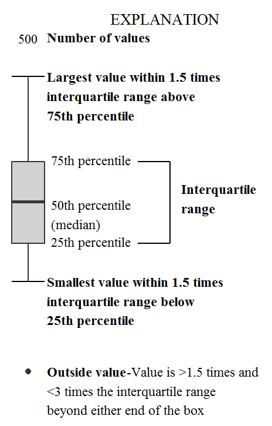

```{r packages_setup, echo=FALSE, message=FALSE, warning=FALSE}
knitr::opts_chunk$set(echo = T, warning = F, message = F)
knitr::opts_chunk$set(fig.width=7, fig.height=5, fig.align='center') 
```

class: center, middle, inverse, title-slide

<div class="title-logo"></div>

<br>
# Análisis y Explotación de la Información

## Tema 2 - Análisis Exploratorio de los Datos

### 2.1 Visualización 

<br>
.pull-left[
### Roi Naveiro
]
---

## Análisis Exploratioro de los Datos

* El arte de observar los datos, generar hipótesis y testearlas.

* **Objetivo**: generar preguntas prometedoras para, posteriormente, explorarlas en mayor profunidad

```{r pressure, echo=FALSE, out.width = '80%',  fig.align='center'}
knitr::include_graphics("img/data-science-explore.png")
```

---
## tidyverse

Queremos analizar los datos de forma **reproducible**

.pull-left[

]

.pull-right[
.center[
[tidyverse.org](https://www.tidyverse.org/)
]

- Tidyverse es una colección de paquetes de R para ciencia de datos
- Todos los paquetes comparten una filosofía y una gramática comunes
]


---
class: center, middle, inverse

# El objeto tibble

---
## El objeto tibble

* Todos los paquetes de tidyverse trabajan con tibbles

* El objeto tibble es similar al data frame que hemos visto

* No obstante, incluye algunas novedades que lo hacen especialmente conveniente para el análisis de datos.

* Antes de empezar, debemos cargar la librería `tidyverse`

```{r}
library(tidyverse)
```
---
## Creación de tibbles

* Podemos crear un tibble desde un dataframe

```{r}
as_tibble(iris)
```

---
## Creación de tibbles

* Podemos crear un tibble desde vectores, de manera similar a cómo hicimos con dataframes

```{r}
dt <- tibble(
  p = c("A", "B", "C", "D", "E"),
  x = 1:5,
  y = 2,
  z = x + y
)
dt
```

---
## Creación de tibbles

* Podemos dar nombres complejos a las columnas de un tibble

```{r}
dt <- tibble(
  `Número de :)` = 1:5,
  ` ` = 2,
  `300` = 300
)
dt
```

---
## Tibbles vs Data Frames

### Printing

Los tibble tienen un método `print` refinado que por defecto solo muestra las 10 primeras filas

```{r}
iris
```

---
## Tibbles vs Data Frames

### Printing

Los tibble tienen un método `print` refinado que por defecto solo muestra las 10 primeras filas

```{r}
dt <- as_tibble(iris)
```

---
## Tibbles vs Data Frames

### Printing

Esto es así para no sobrecargar la consola con los prints. ¿Y si necesitamos más de 10 filas? ¡PIPES!

```{r}
dt %>% print(n=11, width=Inf)
```

---
## Tibbles vs Data Frames

### Printing

En RStudio, esto nos permite explorar el dataframe en una pantalla diferente.

```{r, eval=F}
dt %>% View()
```

---
## Tibbles vs Data Frames

### Subsetting

Para seleccionar una única variable usar `$` (por nombre) o `[[` (por nombre o posición)
```{r}
# Extraer por nombre
dt$Species[1:10]

# Extraer por posicion
dt[[5]][1:10]
```


---
## Tibbles vs Data Frames

### Subsetting

También en pipe
```{r}
dt %>% .$Species
```

---
## Tibbles vs Data Frames

Convertir de nuevo a data frame
```{r}
class( as.data.frame(dt) )
```


---
class: center, middle, inverse

## Visualización

---

## Visualización

Creación y estudio de representaciones visuales de los datos

* En esta parte del curso nos centraremos en aprender a manejar `ggplot2` un paquete de tidyverse realmente útil para la visualización

* EDA incluye, además de visualización, la manipulación de datos

* EDA combina la visualización y la manipulación con la curiosidad y el escepticismo de cada uno para preguntar y responder cuestiones interesantes acerca de los datos

---

## ggplot2 

- **ggplot2** es el paquete de visualización de tidyverse
-  `gg` significa Grammar of Graphics
- Está inspirado en el libreo **Grammar of Graphics** de Leland Wilkinson

```{r, echo=FALSE, out.width = '60%',  fig.align='center'}
knitr::include_graphics("img/grammar-of-graphics.png")
```

GG: herramienta que permite describir de forma secuencial los componentes de un gráfico


---
## Visualización

Primero cargamos las librerías necesarias

```{r}
library(tidyverse)
library(gapminder)
```

Ojeamos los datos

```{r, echo=F}
options(width = 60)
```

```{r}
glimpse(gapminder)
```

---

class: center, middle, inverse

# Visualización: Visualizando la relación entre PIB per capita  y esperanza de vida

---


## Primera visualización

¿Qué hace cada línea?
```{r, fig.align='center',out.extra='angle=90'}
gapminder67 <- gapminder %>% filter(year == "1967")  #<< 
ggplot(gapminder67, 
     aes(gdpPercap, lifeExp, size = pop, color = continent)) + 
     geom_point() +
     scale_x_log10()  # convert to log scale

```


---

## Primera visualización

¿Qué hace cada línea?

```{r, fig.align='center',out.extra='angle=90'}
gapminder67 <- gapminder %>% filter(year == "1967") 
ggplot(gapminder67,  
     aes(gdpPercap, lifeExp, size = pop, color = continent)) +  
     geom_point() +  #<<
     scale_x_log10()  # convert to log scale
```

---

## Primera visualización

¿Qué hace cada línea?

```{r, fig.align='center',out.extra='angle=90'}
gapminder67 <- gapminder %>% filter(year == "1967") 
ggplot(gapminder67,  #<<
     aes(gdpPercap, lifeExp, size = pop, color = continent)) +  #<<
     geom_point() + 
     scale_x_log10()  

```

---

## Funcionamiento `ggplot2`

- La estructura del código de `ggplot2` es la siguiente

```{r eval = FALSE}
ggplot(data = [dataset], 
       mapping = aes(x = [x-variable], y = [y-variable])) +
   geom_xxx() +
   otras opciones
```

* El `mapping`  define como las variables son mapeadas a propiedades visuales del gráfico.

Documentación [ggplot2.tidyverse.org](http://ggplot2.tidyverse.org/)

---
## Funcionamiento `ggplot2`

- Alternativamente

```{r eval = FALSE}
ggplot(data = [dataset]) +
   geom_xxx( mapping = aes(x = [x-variable], y = [y-variable]) ) +
   other options
```


---
## Paso a Paso

Ojeamos los datos

```{r, echo=F}
options(width = 60)
```

```{r}
glimpse(gapminder)
```

Miramos `?gapminder`

---
## Paso a Paso
```{r}
gapminder67 <- gapminder %>% filter(year == "1967") 
gapminder67
```


---
## Paso a Paso
```{r, fig.align='center',out.extra='angle=90'}
ggplot(gapminder67, aes(x = gdpPercap, y = lifeExp) ) +  
     geom_point() 
```

¿Cómo describirías la relación entre pib per capita y esperanza de vida?

---
## Paso a Paso
```{r, fig.align='center',out.extra='angle=90'}
ggplot(gapminder67, aes(x = gdpPercap, y = lifeExp) ) +  
     geom_point() +
     scale_x_log10()  #<<
```

¿Cómo describirías la relación entre pib per capita y esperanza de vida?


---
## Variables adicionales

Es posible que queramos representar más de dos variables. Podemos hacerlo a través de otros elementos
del gráfico (en mapping usamos solo x e y, podemos añadir más)

* **aesthetics**: 

  * shape
  * color
  * size
  * alpha (transparencia)

* **faceting**: varias gráficas

---
class: center, middle, inverse

# Visualización: Aesthetics

---

## Aesthetics

Las siguientes características visuales del gráfico pueden ser utilizadas para representar 
una variable extra

* shape
* color
* size
* alpha (transparencia)

---
## Representamos el continente

```{r, fig.align='center',out.extra='angle=90'}
ggplot(gapminder67, mapping = aes(x = gdpPercap, y = lifeExp, color = continent) ) +   #<<
     geom_point() +
     scale_x_log10()
```

---
## Representamos el continente

```{r, fig.align='center',out.extra='angle=90'}
ggplot(gapminder67, mapping = aes(x = gdpPercap, y = lifeExp, color = continent,  #<<
                        shape = continent) ) +   #<<
     geom_point() +
     scale_x_log10()
```

---
## Representamos el continente y la población

```{r, fig.align='center',out.extra='angle=90'}
ggplot(gapminder67, mapping = aes(x = gdpPercap, y = lifeExp, color = continent,  #<<
                        shape = continent, size = pop) ) +   #<<
     geom_point() +
     scale_x_log10()
```

---
## Representamos el continente y la población

```{r, fig.align='center',out.extra='angle=90'}
ggplot(gapminder67, mapping = aes(x = gdpPercap, y = lifeExp, color = continent, 
                        shape = continent, size = pop) ) +  
     geom_point(size=3) +  #<<
     scale_x_log10()
```

---
## Resumen
- Variables contínuas
- Variables discretas

.small[
aesthetics    | discreta                 | contínua
------------- | ------------------------ | ------------
color         | diferentes colores       | gradiente
size          | pasos discretros         | mapeo linear entre variable y radio
shape         | diferentes formas        | no funciona

]

<br>

.alert[`aes` para representar variables usando características del gráfico

`geom_xxx` para definir característica del gráfico
]

---
class: center, middle, inverse

# Visualización: Faceting

---

## Faceting

Múltiples gráficas en función de variable

```{r, fig.width=6.5, fig.height=4.5}
ggplot(data = gapminder67, aes(x = gdpPercap, y = lifeExp)) + 
  geom_point() +
  labs(title = "PIB per Cápita vs Esperanza de Vida",
       subtitle = "Por continente",
       x = "PIB per Cápita ($)", y =  "Esperanza de vida (años)") +
  facet_grid(. ~ continent)  #<<
```

---

## Faceting

Múltiples gráficas en función de variable

```{r, fig.width=6.5, fig.height=4.5}
ggplot(data = gapminder67, aes(x = gdpPercap, y = lifeExp)) + 
  geom_point() +
  labs(title = "PIB per Cápita vs Esperanza de Vida",
       subtitle = "Por continente",
       x = "PIB per Cápita ($)", y =  "Esperanza de vida (años)") +
  facet_grid(continent ~ .)  #<<
```

---

## Faceting

Múltiples gráficas en función de variable

```{r, fig.width=6.5, fig.height=4.5}
ggplot(data = gapminder67, aes(x = gdpPercap, y = lifeExp)) + 
  geom_point() +
  labs(title = "PIB per Cápita vs Esperanza de Vida",
       subtitle = "Por continente",
       x = "PIB per Cápita ($)", y =  "Esperanza de vida (años)") +
  facet_wrap(continent ~ .)  #<<
```

---

## Faceting

Múltiples gráficas en función de variable

```{r, fig.width=6.5, fig.height=4.5}
ggplot(data = gapminder67, aes(x = gdpPercap, y = lifeExp)) + 
  geom_point() +
  labs(title = "PIB per Cápita vs Esperanza de Vida",
       subtitle = "Por continente",
       x = "PIB per Cápita ($)", y =  "Esperanza de vida (años)") +
  facet_wrap(continent ~ ., scales = "free_x")  #<<
```

---
# Faceting - Resumen


- `facet_grid()`: 
    - Red 2d
    - `filas ~ columnas`
    - `.` para evitar una de ellas

--

- `facet_wrap()`: 1d 
    - fijar escalas con `scales = ` ("free_x", "free_y", "free")

---

## Ejercicio 1


Utilizando los datos de la librería `gapminder`:

* Filtra las obserevaciones correspondientes a los años 1957, 1967, 1977, 1987, 1997, 2007

* Representa la relación entre PIB per cápita y esperanza de vida por continentes y por años
en diferentes gráficas usando **faceting**. El tamaño de los puntos ha de ser proporcional a la población.
El color debe reflejar el continente. 

* ¿Qué conlusiones extraes?


---
class: middle, center

# Visualización: distintos tipos de datos

---

## Número de variables a visualizar

- .vocab[Análisis de datos univariante]: distribución de una variable

<br> 

- .vocab[Análisis de datos bivariante]: relación entre dos variables

<br> 

- .vocab[Análisis de datos multivariantes]: relación entre varias variables, generalmente enfocándose en dos y condicionando por el resto


---

## Tipos de variables

- .vocab[Variables numéricas] pueden ser .vocab[contínuas] o .vocab[discretas] 
    - *altura* es ?
    - *número de cigarros diarios* es ?
    - *distancia* es ?

--

- .vocab[Variables categóricas], a su vez incluyen .vocab[ordinales] si existe un orden natural
entre sus niveles o .vocab[no ordinales]
    - *color de ojos*  es ?
    - *talla de camiseta* es ?

Según tipo de variable tendremos un tipo de representación

---
class: center, middle

# Visualización: datos univariantes numéricos

---

## ¿Cómo podemos describir datos númericos univariantes?

- .vocab[Forma:]
    - asimetría: simétrico, asimétrico a la derecha, asimétrica a la izquierda
    - número de modas: unimodal, bimodal, multimodal, uniforme
    
- .vocab[Centralidad:] media, mediana, moda

- .vocab[Dispersión:] rango, desviación estándar, rango inter-cuartílico

- .vocab[Outliers:] existen datos raros 

---

## ¿Por qué visualizarlos?

```{r}
library(Tmisc)
```

.pull-left[
```{r quartet-view1, echo=FALSE}
head( quartet[1:22,], 15 )
```
]
.pull-right[
```{r quartet-view2, echo=FALSE}
head( quartet[23:44,], 15 )
```
]

---

## Resumiendo Anscombe's quartet

```{r quartet-summary}
quartet %>%
  group_by(set) %>%
  summarise(
    mean_x = mean(x), mean_y = mean(y),
    sd_x = sd(x), sd_y = sd(y),
    r = cor(x, y)
  )
```

---

## Visualizando Anscombe's quartet

```{r quartet-plot, out.width = "75%", fig.align = "center"}
ggplot(quartet, aes(x = x, y = y)) +
  geom_point() +
  facet_wrap(~ set, ncol = 4)
```

---

## Visualizando datos numéricos univariantes
Histograma - ¿Qué revela este gráfico? (Apuestas...)

```{r}
ggplot(gapminder67, mapping = aes(x = gdpPercap)) + 
     geom_histogram(binwidth = 1000) #<<
```

---

## Visualizando datos numéricos univariantes
Histograma - ¿Qué revela este gráfico? (Apuestas...)

```{r}
ggplot(gapminder67, mapping = aes(x = gdpPercap)) + 
     geom_histogram(bins = 100) #<<
```

---

## Visualizando datos numéricos univariantes
A veces útil

```{r}
ggplot(gapminder67, mapping = aes(x = gdpPercap)) + 
     geom_density() #<<
```


---
class: center, middle

## Visualización: datos univariantes categóricos

---
## Visualización de datos univariantes categóricos

Gráfico de barras 
```{r}
ggplot(gapminder67, mapping = aes(x = continent)) + 
  geom_bar() #<<
```

---
class: center, middle

## Visualización: datos bivariantes

---

## Visualización: datos bivariantes contínuo - categórico

```{r}
ggplot(gapminder67, mapping = aes(x = continent, y = gdpPercap)) + 
  geom_boxplot() #<<
```

---
## Visualización: datos bivariantes contínuo - categórico
```{r, echo=FALSE, out.width = '50%',  fig.align='center'}

```

---
## Visualización: datos bivariantes contínuo - continuo

A veces queda bien añadir un ajuste
```{r, fig.align='center',out.extra='angle=90', fig.width=6, fig.height=4}
ggplot(gapminder67, aes(x = gdpPercap, y = lifeExp) ) +  
     geom_point() +
     scale_x_log10() +
     geom_smooth() #<<
```

---
## Visualización: datos bivariantes categórico - categórico

Dataset `diamonds`

```{r out.width = "70%", fig.align='center'}
ggplot(data = diamonds, mapping = aes(x = clarity, fill = cut)) + 
  geom_bar()  #<<
```

---
## Visualización: datos bivariantes categórico - categórico

Dataset `diamonds`

```{r out.width = "70%", fig.align='center', fig.width=6, fig.height=4}
ggplot(data = diamonds, mapping = aes(x = clarity, fill = cut)) + 
  geom_bar(position = "fill") + #<<
  labs(y = "proportion") 
```

---
class: center, middle

## Visualización: transformaciones estadísticas

---

## Transformaciones estadísticas

Los gráficos como histogramas, gráficos de barras o boxplots realizan transformaciones a los datos antes de representarlos

* Gráficos de barras e histogramas: parcelan los datos y representan un número por cada parcela

* Smoothers: ajustan un modelo y representan predicciones generadas por el mismo

* Boxplots: calculan un resumen de la distribución y lo pintan en determinado formato

El argumento para especificar el estadistico de resumen es  `stat`. Puedes ver su valor por defect en, e.g. `?geom_bar`

---

## Transformaciones estadísticas

```{r out.width = "70%", fig.align='center'}
ggplot(data = diamonds) + 
  geom_bar(mapping = aes(x = cut))  #<<
```

---

## Transformaciones estadísticas

```{r out.width = "70%", fig.align='center'}
ggplot(data = diamonds) + 
  geom_bar(mapping = aes(x = cut, y = stat(prop), group = 1) )  #<<
```


---

## Transformaciones estadísticas

Podemos crear estadísticos propios

```{r out.width = "70%", fig.align='center', fig.width=5, fig.height=3}
ggplot(data = diamonds) + 
  stat_summary( #<<
    mapping = aes(x = cut, y = depth), #<<
    fun.min = min, #<<
    fun.max = max, #<<
    fun = median #<<
  )
```


---
class: center, middle

## Visualización: ajuste de posición

---
## Ajustes de posición

```{r out.width = "70%", fig.align='center'}
ggplot(data = diamonds) + 
  geom_bar(mapping = aes(x = cut, fill = clarity) )
  
```

El apilamiento se realiza automáticamente con el ajuste de posición especificado a través de la variable
`position`

---
## Ajustes de posición - "identity"

```{r out.width = "70%", fig.align='center'}
ggplot(data = diamonds, mapping = aes(x = cut, fill = clarity)) + 
  geom_bar(alpha = 1/5, position = "identity") #<<
  
```

---
## Ajustes de posición - "fill"

¿Para qué es bueno este tipo de gráfico?

```{r out.width = "70%", fig.align='center'}
ggplot(data = diamonds, mapping = aes(x = cut, fill = clarity)) + 
  geom_bar(position = "fill") #<<
```

---
## Ajustes de posición - "dodge"

¿Y este?

```{r out.width = "70%", fig.align='center'}
ggplot(data = diamonds, mapping = aes(x = cut, fill = clarity)) + 
  geom_bar(position = "dodge") #<<
```

---
class: center, middle

## Visualización: coordenadas

---

##  Coordenadas

Por defecto `ggplot2` usa coordenadas Cartesianas. Las coordenadas pueden modificarse con 
`coord_xxx()`

.pull-left[
```{r, out.width = "90%", fig.align='center'}
ggplot(data = mpg, mapping = aes(x = class, y = hwy)) + 
  geom_boxplot()
```
]
.pull-right[
```{r, out.width = "90%", fig.align='center'}
ggplot(data = mpg, mapping = aes(x = class, y = hwy)) + 
  geom_boxplot() +
  coord_flip() #<<
```
]

---

##  Coordenadas

`coord_quickmap()` calcula el ratio correcto para mapas

.pull-left[
```{r, out.width = "90%", fig.align='center'}
library(maps)
nz <- map_data("nz")

ggplot(nz, aes(long, lat, group = group)) +
  geom_polygon(fill = "white", colour = "black")
```
]
.pull-right[
```{r, out.width = "90%", fig.align='center'}
ggplot(nz, aes(long, lat, group = group)) +
  geom_polygon(fill = "white", colour = "black") +
  coord_quickmap() #<<
```
]

---

##  Coordenadas

`coord_polar()`

.pull-left[
```{r, out.width = "70%", fig.align='center'}
bar <- ggplot(data = diamonds) + 
  geom_bar(
    mapping = aes(x = cut, fill = cut), 
    show.legend = FALSE,
    width = 1
  ) + 
  theme(aspect.ratio = 1) +
  labs(x = NULL, y = NULL)

bar + coord_flip() #<<
```
]
.pull-right[
```{r, out.width = "70%", fig.align='center'}
bar + coord_polar()  #<<
```
]
---
## Resumen

```{r, eval=FALSE}
ggplot(data = <DATA>) + 
  <GEOM_FUNCTION>(
     mapping = aes(<MAPPINGS>),
     stat = <STAT>, 
     position = <POSITION>
  ) +
  <COORDINATE_FUNCTION> +
  <FACET_FUNCTION>
```

---
class: center, middle

## Visualización: consejos

---
## Consejos

[https://blog.csgsolutions.com/6-tips-for-creating-effective-data-visualizations](https://blog.csgsolutions.com/6-tips-for-creating-effective-data-visualizations)
---


## Bibliografía

* [R for Data Science](https://r4ds.had.co.nz/), Wickham and Grolemund (2016)

* [ggplot2.tidyverse.org](http://ggplot2.tidyverse.org/)

* [Data Visualization, A practical introduction](https://socviz.co/), Healy (2018)

* [ggplot2.tidyverse.org](https://ggplot2.tidyverse.org/)

* `ggplot2` [cheat sheet](https://diegokoz.github.io/intro_ds/fuentes/ggplot2-cheatsheet-2.1-Spanish.pdf)

* [Top 50 `ggplot2` visualizations](http://r-statistics.co/Top50-Ggplot2-Visualizations-MasterList-R-Code.html)

* [How the BBC uses `ggplot2`](https://medium.com/bbc-visual-and-data-journalism/how-the-bbc-visual-and-data-journalism-team-works-with-graphics-in-r-ed0b35693535)

* [ggplot2: Elegant Graphics for Data Analysis](https://ggplot2-book.org/)