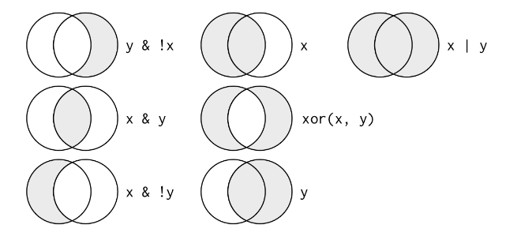

```{r packages_setup, echo=FALSE, message=FALSE, warning=FALSE}
knitr::opts_chunk$set(echo = T, warning = F, message = F)
knitr::opts_chunk$set(fig.width=7, fig.height=5, fig.align='center') 
```

class: center, middle, inverse, title-slide

<div class="title-logo"></div>

<br>

# Análisis y Explotación de la Información

## Tema 2 - Análisis Exploratorio de los Datos

### 2.2 Transformación 

<br>
.pull-left[
### Roi Naveiro
]
---

## Análisis Exploratioro de los Datos

* El arte de observar los datos, generar hipótesis y testearlas.

* **Objetivo**: generar preguntas prometedoras para, posteriormente, explorarlas en mayor profunidad

```{r pressure, echo=FALSE, out.width = '80%',  fig.align='center'}
knitr::include_graphics("img/data-science-explore.png")
```


---
class: center, middle, inverse

## Transformación de datos

---

## Transformación de datos

La visualización es clave para un buen entendimiento de los datos...

... no obstante, rara vez encontramos los datos en el formato necesario.

En general, **necesitamos**

- Crear nuevas variables

- Resumir variables

- Renombrar

- Reordenar observaciones

- Agrupar

- ...

---

## Graḿatica de transformación de datos

Aprenderemos cómo hacer esto de forma **reproducible** con el paquete `dplyr` 


```{r dplyr-part-of-tidyverse, echo=FALSE, out.width="30%", fig.align = "center", caption = "dplyr is part of the tidyverse"}
knitr::include_graphics("img/dplyr-part-of-tidyverse.png")
```

Similar a `ggplot2`, `dplyr` introduce una grámatica para la transformación de datos
---

## Graḿatica de transformación de datos

Algunas de las funciones (verbos) que aprenderemos

.small[
- `select`: seleccionar columnas por nombre
- `rename`: renombrar variables
- `arrange`: ordenar filas según criterio
- `slice`: escoger filas con índices
- `filter`: escoger filas que cumplan cierta condición
- `distinct`: filtrar por filas únicas
- `mutate`: añadir nuevas variables
- `summarise`: resumir variables según ciertos estadísticos
- `group_by`: para realizar operaciones por grupos
- ... 
]

---

## Reglas de `dplyr`

Todos los verbos funcionan de manera similar:

- Primer argumento es el data frame

- Lo siguientes argumentos especifican qué hacer con el data frame, usando los nombres de las variables (sin comillas)

- La salida es otro data frame

Los verbos pueden **concatenarse**


---

## Datos

Para aprender las diferentes transformaciones que podemos hacer sobre los datos, usaremos de nuevo
**gapminder** (más información en `?gapminder`)


```{r, echo=F}
options(width = 60)
```


```{r}
library(tidyverse)
library(gapminder)
glimpse(gapminder)
```

---
class: center, middle, inverse

## Transformación de datos: `select`
---

## Verbo `select`

* En múltiples ocasiones tenemos conjutos de datos con miles de variables

* Nos puede interesar un subconjunto de las mismas

* Para esto utilizamos `select`
---

## Seleccionar una columna

Observar únicamente la variable referente a esperanza de vida (`lifeExp`)


.pull-left[
```{r}
gapminder %>%
  select(lifeExp) #<<
```
]
--
.pull-right[ 
- Pasamos el data frame a través del pipe (`%>%`) a la función `select()`
- El argumento es nombre de variable (sin comillas): `lifeExp`
- Esto de lugar a un dataframe de 1704 filas y 1 columna
]

---
## Seleccionar múltiples columnas

.pull-left[
```{r}
gapminder %>%
  select(lifeExp, country) #<<
```
]
--
.pull-right[ 
```{r}
gapminder %>%
  select(lifeExp:gdpPercap) #<<
```
]

**NOTA**: los verbos no modifican el data frames. Para guardar el output como un nuevo dataframe
```{r, eval=F}
esperanza_vida <- gapminder %>%
  select(lifeExp) 
```

---
## Selección inversa

.pull-left[
```{r}
gapminder %>%
  select(-lifeExp, -pop, -year ) #<<
```
]
--
.pull-right[ 
```{r}
gapminder %>%
  select(-(continent:gdpPercap) ) #<<
```
]

---
## Otras formas de selección

Las siguientes funciones son útiles

- `starts_with("abc")`: nombres que empiezan con "abc"

- `ends_with("abc")`: nombres que terminan con "abc"

- `contains("abc")`: nombres que contienen "abc"

- `matches("(.)//1"`) : selecciona según expresiones regulares 

- `num_range("x", 1:3)`: selecciona x1, x2 y x3

---
## Ejemplo


```{r}
gapminder %>%
  select( starts_with("co")) #<<
```


---
## Seleccionar todas

 `everything()` es útil para colocar ciertas variables al inicio del data frame

```{r}
gapminder %>%
  select( year, everything() ) #<<
```

---
class: center, middle, inverse

## Transformación de datos: `rename`

---
## Renombrar

Para renombrar variables, utilizar `rename`

```{r}
gapminder %>%
  rename( pais = country ) #<<
```

---
class: center, middle, inverse

## Transformación de datos: `arrange`

---
## Ordenar datos

Seleccionemos país, año y esperanza de vida y ordenemos en orden **creciente** de esperanzada de vida

```{r}
gapminder %>%
  select( country, year, lifeExp ) %>% #<<
  arrange(lifeExp) #<<
```
---
## Ordenar datos

Seleccionemos país, año y esperanza de vida y ordenemos en orden **decreciente** de esperanzada de vida

```{r}
gapminder %>%
  select( country, year, lifeExp ) %>% #<<
  arrange(desc(lifeExp)) #<<
```

---
## Ordenar datos

¿Qué sucede?

```{r}
gapminder %>%
  select( country, year, lifeExp ) %>% #<<
  arrange(desc(country)) #<<
```

---
## Ordenar datos

* `arrange` por defecto ordena de manera ascendente (si son números)

* Ante strings, `arrange` ordena por defecto de manera alfabética

* `desc()` cambia el orden 

* Si se pasa más de una variable, se ordena en función de la primera. Las siguientes se utilizan, secuencialmente, para romper empates

* Los valores ausentes pasan al final

---
class: center, middle, inverse

## Transformación de datos: pipes
---

## Los pipes

* Un pipe es una técnica para pasar información de un proceso a otro

* La estructura pipe está implementada en el paquete `magrittr` (que se carga con `tidyverse`)

1. Empezamos con todo el dataset

```{r, eval=F}
gapminder %>% #<<
  select( country, year, lifeExp ) %>% 
  arrange(desc(country))  
```
---

## Los pipes

* Un pipe es una técnica para pasar información de un proceso a otro

* La estructura pipe está implementada en el paquete `magrittr` (que se carga con `tidyverse`)

2. Este entra en `select`, que selecciona country, year, lifeExp

```{r, eval=F}
gapminder %>% 
  select( country, year, lifeExp ) %>% #<<
  arrange(desc(country)) 
```

---

## Los pipes

* Un pipe es una técnica para pasar información de un proceso a otro

* La estructura pipe está implementada en el paquete `magrittr` (que se carga con `tidyverse`)

3. Por útimo, el resultado del select pasa a `arrange`

```{r, eval=F}
gapminder %>% 
  select( country, year, lifeExp ) %>% 
  arrange(desc(country)) #<<
```

---

## Los pipes

Pasando la respuesta a `ggplot2`
```{r}
gapminder %>%
  filter(year == 2007) %>%
  ggplot(., aes(x = lifeExp, fill = continent)) + #<<
  geom_histogram(bins = 100)
```

---
class: center, middle, inverse

## Transformación de datos: `slice`
---

## Seleccionar filas

```{r}
gapminder %>%
  select(country) %>%
  slice(1:3) #<<
```

---

## Ejercicio 1

Usando `slice` selecciona las tres últimas filas del dataset `gapminder`

---
class: center, middle, inverse

## Transformación de datos: `filter`
---

## Filtrado

* Seleccionar filas en función de sus valores

* Los argumentos reflejan las condiciones del filtrado

```{r}
gapminder %>%
  filter(country == "Spain", lifeExp > 80) #<<
```

---
## Filtrado

Para construír filtros complejos, hay que manejar los operadores lógicos 

<br>


Operador    | Definición                   || Operador     | Definición
------------|------------------------------||--------------|----------------
`<`         | Menor que                    ||`x`&nbsp;&#124;&nbsp;`y`     | `x` OR `y` 
`<=`        |	Menor o igual que            ||`is.na(x)`    | ¿es `x` is `NA`?
`>`         | Mayor que                    ||`!is.na(x)`   | ¿ `x` no es `NA`?
`>=`        |	Mayor o igual que            ||`x %in% y`    | `x` pertenece a `y`
`==`        |	Igual a                      ||`!(x %in% y)` |`x` no pertenece `y`
`!=`        |	Distinto a                   ||`!x`          | negación `x`
`x & y`     | `x` AND `y`                  ||              |

---
## Filtrado

¿Qué está pasando?

```{r}
sqrt(2)^2 == 2
```

--
```{r}
near(sqrt(2)^2, 2)
```

---
## Filtrado

<br>
<br>

```{r echo=FALSE, out.width = '80%',  fig.align='center'}

```

---
## Filtrado

Por defecto, los múltiples argumentos de `filter` se combinan con el operador ?

Ejemplo: seleccionar países de América que en el 2007 tuvieran esperanza de vida superior a 75 o un PIB per cápita inferior a 6000

```{r}
gapminder %>%
    filter(year == 2007, continent == "Americas", (lifeExp > 77 | gdpPercap < 4000) ) #<<
```

---
class: center, middle, inverse

## Transformación de datos: valores ausentes

---

## Valores ausentes

* Muy comunes en ciencia de datos

* Casi todas las operaciones con NA devuelven NA

```{r}
NA == 2

NA + 3

NA == NA
```
---

## Valores ausentes

* En el filtrado, solo se incluyen filas con valores `TRUE` de la condición (se excluyen pues los `FALSE` y los `NA`).

* Es fácil preservarlos

```{r}
df <- tibble(x = c(1, NA, 3))
filter(df, x > 1)

filter(df, is.na(x) | x > 1)
```


---
class: center, middle, inverse

## Transformación de datos: `distinct`

---

## Valores únicos
Filtrar valores únicos de filas

```{r}
gapminder %>% 
  distinct(continent, year) %>% #<<
  arrange(continent, desc(year) )
```

---
class: center, middle, inverse

## Transformación de datos: `count`

---
## Crear tablas de frecuencias

.pull-left[
```{r}
gapminder %>% 
  filter(year == 1967) %>% 
  count(continent) #<<
```
]

.pull-right[
```{r}
gapminder %>% 
  filter(year == 1967) %>% 
  count(continent, sort=TRUE) #<<
```
]

---

## Contar y ordenar

```{r}
gapminder %>% 
  filter(year == 1967) %>% 
  count(continent) %>% 
  arrange(n) #<<
```
---

## Contar más de una variable

```{r}
gapminder %>% 
  count(continent, year) #<<
```

---
class: center, middle, inverse

## Transformación de datos: `mutate`

---

## Añadir nuevas columnas

```{r}
gapminder %>%
  mutate(gdp = gdpPercap * pop) %>%
  filter(year == 2007) %>%
  arrange( desc(gdp) )
```

**NOTA 1**: se puede definir más de una variable
**NOTA 2**: en la definición, se puede usar variable recién definida

---

## Añadir nuevas columnas

Múltiples funciones útiles para añadir columnas

* Operadores aritméticos

* Aritmética modular: división entera `%/%`, resto `%%` 

* Logaritmos

* Agregaciones acumulativas `cumsum()`, `cumprod()`, `cummin()`, `cummax()`

* Comparaciones lógicas

* Rankings: `minrank()`

---

## Ejemplos

```{r}
x = c(1,3,2,7,6)
min_rank(x)

33 %% 10

cumsum(x)
```

---
## Reto

Calcula la proporción de países en cada continente, que en el año 1967 tenían esperanza de vida entre  0-10, 10-20, 20-30, etc.
--

```{r}
gapminder %>%
  mutate(lifeExpDecade = lifeExp - lifeExp%%10) %>%
  filter(year == 1967) %>%
  count(continent, lifeExpDecade) %>%
  group_by(continent) %>%
  mutate(prop = n / sum(n)) 
```

---
## Reto

Calcula la proporción de países en cada continente, que en el año 1967 tenían esperanza de vida entre  0-10, 10-20, 20-30, etc.
--

```{r}

gapminder %>%
  mutate(lifeExpDecade = case_when(lifeExp >= 20 & lifeExp< 30 ~ '20',
          lifeExp >= 30 & lifeExp< 40 ~ '30',
          lifeExp >= 40 & lifeExp< 50 ~ '40',
          lifeExp >= 50 & lifeExp< 60 ~ '50',
          lifeExp >= 60 & lifeExp< 70 ~ '60',
          lifeExp >= 70 & lifeExp< 80 ~ '70',
          lifeExp >= 80 & lifeExp< 90 ~ '80',
          lifeExp >= 90 & lifeExp< 100 ~ '90',
          TRUE ~ '>100'
          )) %>%
  filter(year == 1967) %>%
  count(continent, lifeExpDecade) %>%
  group_by(continent) %>%
  mutate(prop = n / sum(n)) 


```


---
class: center, middle, inverse

## Transformación de datos: `summarise`

---
## Creación de estadísticos de resumen

```{r}
gapminder %>%
  filter(year == 1967) %>%
  summarise(mean_gdpPerCapita = mean(gdpPercap))
```

`summarise()` colapsa todas las filas en un único estadístico de resumen y elimina las columnas no necesarias para el cálculo

---

## Resúmenes más útiles

* Localización: `mean()` y `median()`

* Dispersión: `sd()`, `IQR()`

* Rango: `min()`, `quantile(x, 0.25)`, `max()`

* Cuenta: `n()`, `n_distinct()`

---
## Resúmenes más útiles

¿Recuerdas que és la mediana? ¿Y el percentil 25?

---

class: center, middle, inverse

## Transformación de datos: `group_by`


---
class: center, middle, inverse

## Transformación de datos: `group_by`

---

## Agrupaciones

`summarise()` es tremendamente útil cuando se utiliza conjuntamente con `group_by()`.
Esto permite obtener estadísticos de resumen para diferentes grupos

```{r}
gapminder %>%
  filter(year == 1967) %>%
  group_by(continent) %>%
  summarise(mean_gdpPerCapita = mean(gdpPercap))
```

---

## Agrupaciones

```{r}
gapminder %>%
  filter(year == 1967) %>%
  group_by(continent) %>%
  summarise(n = n(),
            mean_gdpPerCapita = mean(gdpPercap),
            median_gdpPercapita = median(gdpPercap),
            )
```

**NOTA**: si hay valores ausentes, añadir `na.rm = TRUE`, e.g. `mean(x, na.rm = TRUE)`
---

## Agrupaciones por varias variables

```{r}
gapminder %>%
  group_by(continent, year) %>%
  summarise(
            max_gdpPercapita    = max(gdpPercap),
            min_gdpPercapita    = min(gdpPercap)
            ) %>% 
  filter(year %in% c(1967, 2007))
```

---

## Bibliografía

* [R for Data Science](https://r4ds.had.co.nz/), Wickham and Grolemund (2016)
