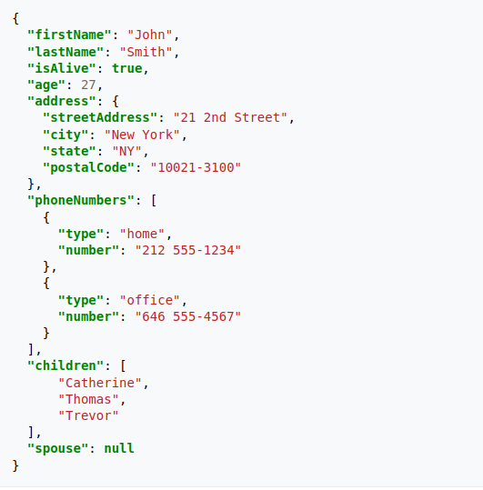

```{r packages_setup, echo=FALSE, message=FALSE, warning=FALSE}
knitr::opts_chunk$set(echo = T, warning = F, message = F)
knitr::opts_chunk$set(fig.width=8, fig.height=6) 
```

class: center, middle, inverse, title-slide

<div class="title-logo"></div>

# Análisis y Explotación de la Información
 
## Tema 3 - Data Wrangling

### 3.1 Importación de Datos
<br>
<br>
.pull-left[
### Roi Naveiro
]
---


## Data Wrangling

**Objetivo**: dejar los datos listos para su posterior **exploración** y **modelización**

Convertir **datos crudos** en **datos procesados**

**Datos crudos**

  - Los datos tal cual aparecen en la fuente de origen
  
  - No han sufrido ninguna manipulación
  
**Datos procesados**

  - Cada variable es una columna
  
  - Cada observación una fila
  
  - Cada unidad observacional es una celda
  
  - Datos más complejos, en varias tablas interconectadas
  
---
## Data Wrangling

* Importación de los datos
* Organización de los datos
* Transformación de los datos

```{r, echo=FALSE, out.width = '100%',  fig.align='center'}
knitr::include_graphics("img/data-science-wrangle.png")
```


---
class: center, middle, inverse

# Importación de datos

---
## Importación de datos

* Aprederemos cómo descargar y leer datos en R

* Nos centraremos en **datos tabulares**

* De nuevo, para esta parte, necesitaremos cargar `tidyverse`

```{r}
library(tidyverse)
```

Seguiremos este esquema

* Descarga de datos
* Lectura de ficheros en R-base
* Lectura de ficheros tidyverse

---
class: center, middle, inverse

# Importación de datos: Descarga de datos

---

## Directorio de trabajo

* Es esencial conocer el directorio de trabajo

* Los comandos esenciales son `getwd()` y `setwd()`

```{r, eval=FALSE}
# Devuelve el directorio de trabajo
getwd()
```

```{r, eval=FALSE}
# Cambia el directorio de trabajo
setwd()

# Directorio relativo al directorio raíz
setwd("./data")

# Directorio relativo al directorio superior al raíz
setwd("../data")

# Directorio absoluto
setwd("/home/roi/data")
```
---

## Descarga de datos

Vamos a ver cómo crear una carpeta `data` desde R (si esta no existe) y descargar unos datos dentro de la misma

1. Comprobar si existe una carpeta llamada `data` en el directorio actual. Si no, crearla. Usar funciones `file.exists()` y `dir.create()`. Inténtalo


---

## Descarga de datos

Vamos a ver cómo crear una carpeta `data` desde R (si esta no existe) y descargar unos datos dentro de la misma

1. Descarga los datos sobre los indicadores de calidad de vino tinto [https://archive.ics.uci.edu/ml/datasets/Wine+Quality](https://archive.ics.uci.edu/ml/datasets/Wine+Quality).

```{r, eval=FALSE}
data_url <- "https://archive.ics.uci.edu/ml/machine-learning-databases/wine-quality/winequality-red.csv"
download.file(data_url, destfile = "data/red_qualities.csv")
list.files("./data")
```

---
class: center, middle, inverse

# Importación de datos: Lectura de ficheros en R-base
---

## `read.table()`

```{r}
# Así leemos datos con read.table
# OJO: el separador es ;
red_wine_data <- read.table("data/red_qualities.csv", header = T, sep = ';')
head(red_wine_data)
```

---

##  `read.table()`

Algunos parámetros importantes

* _na.strings_ - elegir el caracter que representa un valor ausente
* _nrows_ - cuántas filas leer (e.g. nrows=10 lee 10 filas)
* _skip_ - número de filas a ignorar hasta empezar lectura

---
## Leer excell

Esto require la librería `openxlsx`

```{r eval=F}
library(openxlsx)
red_wine_data <- read.xlsx("data/red_qualities.xlsx", 
                           sheet = 1)

head(red_wine_data)
```


---
## Leer JSON

* Javascript Object Notation

* Almacenamiento ligero de datos

* Es un formato común en APIs

* Los datos se guardan objetos con pares atributo-valor y matrices

---
## Leer JSON


```{r, echo=FALSE, out.width = '70%',  fig.align='center'}

```

---
## Leer JSON
```{r}
library(jsonlite)

# Leer JSON
iris_JSON <- read_json("data/iris.json", simplifyVector = TRUE)

# Convertir en dataframe
iris_df <- fromJSON(iris_JSON)

head(iris_df)
```

---
## Leer JSON
```{r}
# La función prettify nos imprime el JSON de forma limpia
prettify(iris_JSON)
```

---
class: center, middle, inverse

# Importación de datos: Lectura de ficheros con paquetes de tidyverse

---
## El paquete `readr`

Ahora veremos cómo leer datos con el paquete `readr` que es parte de `tidyverse`

```{r}
library(tidyverse)
```

Las funciones de `readr` se encargan de transfromar ficheros planos en *tibbles*


---

.pull-left[
## readr

- `read_csv()` - ficheros delimitados por `,`
- `read_csv2()` - ficheros delimitados por `:`
- `read_tsv()` - ficheros delimitados por tabulador
- `read_delim()` - ficheros con cualquier delimitación
- ...
]

--
.pull-right[
## readxl

- `read_excel()` - ficheros xls o xlsx 
- ...
]

---
## Lectura de datos

```{r}
red_wine_data <- read_csv2("data/red_qualities.csv")
red_wine_data
```
---
## Lectura de datos

También podemos pasarle un csv escrito a mano
```{r}
df <- read_csv("a,b,c
               1,2,3
               4,5,6")
df
```

---
## Lectura de datos

También podemos pasarle un csv escrito a mano
```{r}
# Así prevenimos la lectura de una línea 
df <- read_csv("Línea de metadatos
               a,b,c
               1,2,3
               4,5,6", skip=1)
df
```

---
## Lectura de datos

También podemos pasarle un csv escrito a mano
```{r}
# Así prevenimos la lectura de comentarios
df <- read_csv("# Línea de metadatos
               a,b,c
               # Un comentario
               1,2,3
               4,5,6", comment = '#')
df
```

---
## Lectura de datos

Si las columnas no tienen nombre
```{r}
df <- read_csv("a,b,c
               1,2,3
               4,5,6", col_names=FALSE)
df
```

---
## Lectura de datos

Si queremos nombrar las columnas

```{r}
df <- read_csv("a,b,c
               1,2,3
               4,5,6", col_names=c("p", "q", "r"))
df
```

---
## Lectura de datos

Dar nombres en formato apropiado

```{r}
df <- read_csv("Nombre Apellido, Es Fumador, EDAD_PACIENTE
               Juan Montero, SI, 35
               Maria Chacón, NO, 64")
df %>% janitor::clean_names()
```

---
## Lectura de datos

Podemos indicar que caracteres se refieren a un valor ausente

```{r}
df <- read_csv("a,b,c
               1,nan,3
               4,5,nan", na = "nan")
df
```

---
class: center, middle, inverse

# Importación de datos: Parsear vectores y ficheros

---
## Parsear vectores

La función `read_csv` **parsea** un fichero de texto. Es decir, convierte un fichero
de texto en una estructura de datos organizada.

Para entender mejor cómo hace esto debemos entender las funciones `parse*()`

Estas convierten un vector de caracteres en un vector de datos especializado

```{r}
str(parse_logical(c("T", "F", "F")))
str(parse_integer(c("1", "4")))
str(parse_date(c("2022-01-04")))
```

---
## Parsear vectores

Como todas las funciones de tidyverse, las funciones `parse*()` son uniformes:
el primer argumento es el vector a parsear y `na` permite indicar que caracteres
serán tratados como valores ausentes

```{r}
parse_integer(c("1", "4", "."), na=".")
```

---
## Parsear vectores

Si hay problemas, sale un mensaje warning
```{r, warning=T}
parse_integer(c("1", "4", "c"))
```

---
## Tipos de parseadores

* `parse_logical()` y `parse_integer()` para lógicos y enteros. Los más sencillos, dada su uniformidad

* `parse_double()` para números y `parse_number()` (más flexible). Son más complejos

* `parse_factor()` para variables tipo factor (categóricas con valores fijos y conocidos)

* `parse_datetime()`, `parse_date()` y `parse_time()` para tiempos y fechas. Son los más complejos dada la variabilidad en la escritura de fechas y tiempos.

---
## Tipos de parseadores - Números

Tres problemas

1. Los números se escriben de manera diferente en distintas partes del mundo (1.45 vs 1,45)

2. A veces los números vienen con símbolos (100%)

3. Caracteres de agrupamiento (1.000.000)

---
## Tipos de parseadores - Números

1. Los números se escriben de manera diferente en distintas partes del mundo (1.45 vs 1,45)

```{r}
parse_double("1,45", locale = locale(decimal_mark = ","))
```

---
## Tipos de parseadores - Números

2. A veces los números vienen con símbolos (100%)

```{r}
parse_number("100$")
parse_number("30%")
parse_number("Me costó 100 €")
```

---
## Tipos de parseadores - Números

3. Caracteres de agrupamiento (1.000.000)

```{r}
parse_number("%100,330")
parse_number("100.330€$", locale = locale(grouping_mark = "."))
```

---
## Tipos de parseadores - Factores

Hay que dar a `parse_factor` un vector de posibles niveles

```{r}
parse_factor(c("hombre", "mujer", "mujer", "unicornio"), levels=c("hombre", "mujer"))
```


---
## Tipos de parseadores - Fechas y horas

`parse_datetime()` para fecha con hora. Espera, en este orden, año, mes, dia, hora, minuto y segundo
```{r}
parse_datetime("2022-01-01T1015")
```

`parse_date()` para fecha. Espera, en este orden, año, mes, dia, separados por `-` o `/`
```{r}
parse_date("2022/01/01")
```

---
## Tipos de parseadores - Fechas y horas

`parse_time()` para hora. Espera, en este orden, hora, minuto y segundo separados por `:` y am pm opcionales
```{r}
parse_time("10:15 am")
```

También se puede especificar el formato

```{r}
parse_date("01/04/22", "%d/%m/%y")
```

[Más información sobre los formatos](https://readr.tidyverse.org/reference/parse_datetime.html)

---
## Tipos de parseadores - Fechas y horas

- **Año**

:   `%Y` (4 dígitos).

:   `%y` (2 dígitos); 00-69 -\> 2000-2069, 70-99 -\> 1970-1999.

- **Mes**

:   `%m` (2 dígitos).

:   `%b` (nombre abreviado, como "Jan").

:   `%B` (nombre completo, "January").

- **Día**

:   `%d` (2 dígitos).

:   `%e` (espacio opcional).

---
## Tipos de parseadores - Fechas y horas

- **Tiempo**

:   `%H` 0-23 horas

:   `%I` 0-12, usar con `%p`.

:   `%p` AM/PM

:   `%M` minutos

:   `%S` segundos, número entero.

:   `%OS` rsegundos reales.

:   `%Z` Franja horaria (e.g. `America/Chicago`).


:   `%z` (como offset de UTC, e.g. `+0800`).


---
## Parsear un fichero

Intentemos entender

1. Cómo `readr` acierta automáticamente el tipo de columna para parsearla

2. Cómo cambiar la especificación por defecto

---
## Parsear un fichero

1. Cómo `readr` acierta automáticamente el tipo de columna para parsearla

Para esto, `readr` lee las primeras 1000 filas y cada columna y usa una heurística para adivinar el tipo.

```{r}
guess_parser("2022-01-01")
str(parse_guess("2022-01-01"))
```

---

## Parsear un fichero

A veces esta estrategia falla

* Puede ser que las 1000 primeras filas sean casos especiales (1000 enteros en variable double)

* La columna puede contener valores ausentes

Es recomendable, cuando se pueda, especificar el tipo de columnas

---
## Ejemplo

```{r}
read_csv("data/df-na.csv")
```

---
## Ejemplo

```{r}
read_csv("data/df-na.csv", col_types = list(col_double(), col_character(), 
                                            col_character()))
```

---
class: center, middle, inverse

# Importación de datos: escritura de datos

---
# Escritura de datos

Tres funciones principales

* `write_csv()`: escribe en csv

* `write_tsv()`: escribe en tsv

* `write_excel_csv()`: escribe en excell

El uso

```{r, eval=FALSE}
write_csv(df, "df.csv")
```

---
# Escritura de datos

Con estas funciones se pierde información (por ejemplo el tipo de columnas).

Recomendable usar `write_rds()` y `read_rds()` (análogas a `readRDS()` y `writeRDS()` de R Base)

Estas guardan ficheros en formato binario RDS

---
# Escritura de datos

```{r}
write_rds(iris, "data/iris.RDS")
iris_tibble = read_rds("data/iris.RDS")
iris_tibble
```

---
## Otros datos

Para el resto de tipos de datos que no hemos estudiado, existen paqutes de tidyverse 

* **haven**: SPSS, Stata, SAS

* **readxl** para excel

* **DBI** junto con **RMySQL**, **RSQLite**, etc. para lanzar queries de SQL contra bases de datos y devolver un data frame


---

## Bibliografía

Este tema está fundamentalmente basado en  [R for Data Science](https://r4ds.had.co.nz/), Wickham and Grolemund (2016)