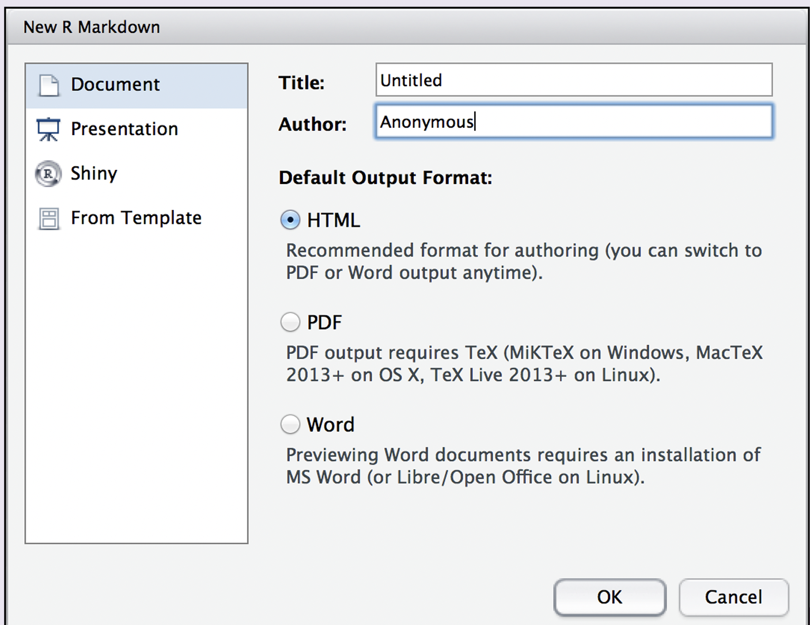
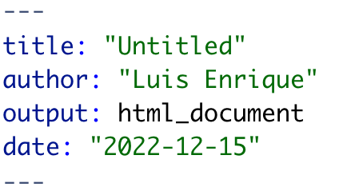
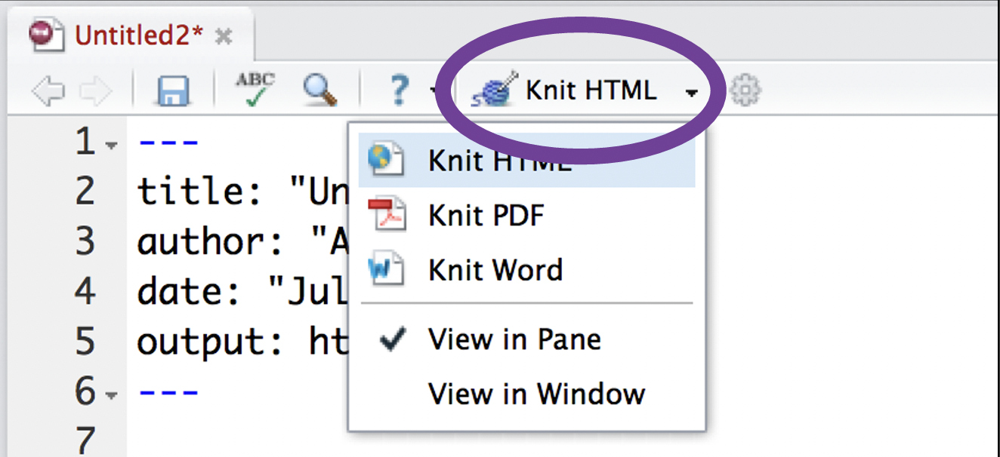
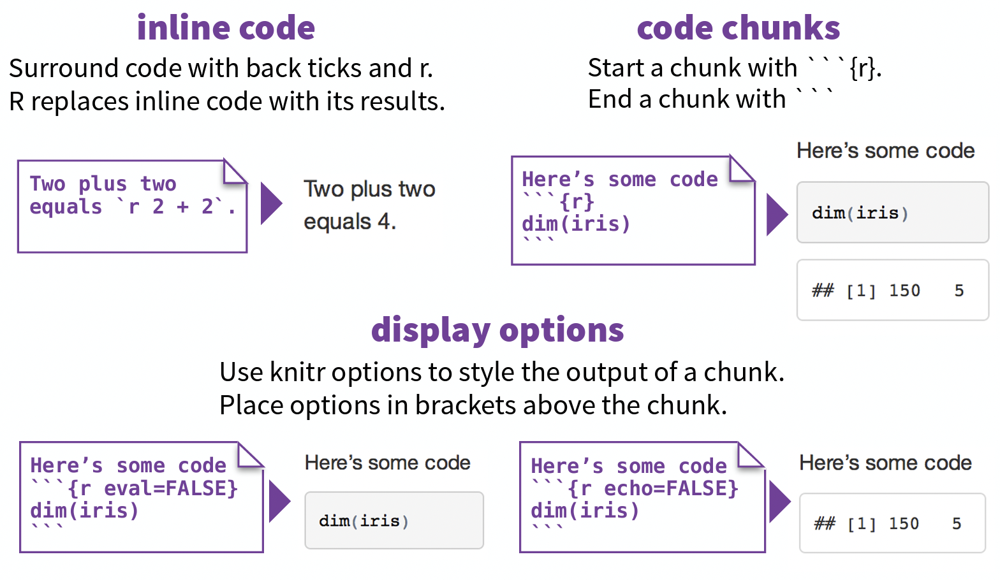

```{r packages_setup, echo=FALSE, message=FALSE, warning=FALSE}
knitr::opts_chunk$set(echo = T, warning = F, message = F)
knitr::opts_chunk$set(fig.width=8, fig.height=6) 
```

class: center, middle, inverse, title-slide

<div class="title-logo"></div>

# Análisis y Explotación de la Información
 
## Tema 5 - Comunicación de Resultados

<br>
<br>
.pull-left[
### Roi Naveiro
]
---
## Informes

Aprenderemos cómo realizar informes en R Markdown

```{r, echo=FALSE, out.width = '100%',  fig.align='center'}
knitr::include_graphics("img/data-science-communicate.png")
library(tidyverse)
```


---
## RMD

R Markdown es un formato para escribir informes reproducibles con R. Se utiliza para incrustar código R y resultados en presentaciones de diapositivas, archivos PDF, documentos html, etc. Para hacer un informe:

1. Abre un fichero Rmd
2. Escribe **contenido**
3. Incluye **código**
4. Renderizalo en el formato deseado

---
## Abrir fichero RMD

* **File** - **New File** - **R Markdown...**

```{r, echo=FALSE, out.width = '60%',  fig.align='center'}

library(tidyverse)
```

* Elegir format que interese: pdf o html para este curso.

---
## Rellenar el encabezado

```{r, echo=FALSE, out.width = '70%',  fig.align='center'}

library(tidyverse)
```

* `output: pdf_document`: para PDF
* `output: html_document`: para HTML

---
## Renderizar

* Para renderizar

```{r, echo=FALSE, out.width = '70%',  fig.align='center'}

```

---
## Renderizar

Cuando renderizas, R hace lo siguiente:

* Ejecutará cada fragmento de código incrustado e insertará los resultados en el informe 

* Construirá una nueva versión del informe en el tipo de archivo de salida

* Abrirá una vista previa del archivo de salida 

* Guardará el archivo de salida en tu **directorio de trabajo**

* **INSTALAR tinytex PARA PDF**!!!!

---
## Escribir contenido

Muy sencillo, tan solo unas pocas reglas

`# Título`
# Título

`## Subtítulo`
## Subtítulo

`### Subsubtítulo`
### Subsubtítulo

---
## Escribir contenido

`**Negrita**`
**Negrita**

`*Cursiva*`
*Cursiva*

`[link](www.rstudio.com)`
[link](www.rstudio.com)   

---
## Escribir contenido

`*` Puntos

* Puntos

`1.` Enumeración

1. Enumeración 

2. Bla 

---
## Escribir código

**Siempre en bloque de código**

```{r, echo=FALSE, out.width = '80%',  fig.align='center'}

```

---
## Escribir código

* `echo = FALSE`: el código se evalúa, se muestra su salida, pero no se muestra el bloque de código

* `eval = FALSE`: el código NO se evalúa, NO se muestra su salida, pero SÍ se muestra el bloque de código

* Por defecto, ambos son `TRUE`
---

## Bibliografía

Este tema está basado en  [Rmd Cheat Sheet](https://www.rstudio.com/wp-content/uploads/2015/02/rmarkdown-cheatsheet.pdf)